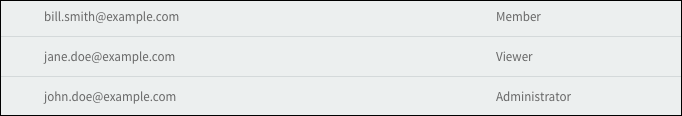

 

NOTE: Users can now use APIs for build automation (curl command to create a build, upload a file, release a build, etc.). Please reference this [link](https://app-distribution.pivotal.io/docs) for more information

##Create a project and add users to the project team
1. Click **New Project**. (i.e. setting up a new App project page from which the release will be sent)
1. Add Project Name, Client Name, Platform, Description, and project mailing list.
1. Add Pivotal Tracker and Token (if Tracker has been installed).
1. Add Users to the project and assign a role as described below:

  * Administrator - Can add users to a project, create releases
  * Member - Can create builds to send to QA and clients. Can also receive QA builds
  * Viewer - Can only view releases that have been approved by QA and released to the project team

###Add multiple users to a project (import via text file)

Multiple users can be added simulatenously by import a list of email addresses from a .csv file

1. From a plain text editor, create a file with the list of email addresses and respective user role as per the example shown below. These can be new users or existing users from another project.

   email,role  
john.doe@example.com,administrator  
jane.doe@example.com,member  
bill.smith@example.com,viewer

   Once created, save the file with a '.csv' extension.

2. In the Add/Remove Users section of the project, click on the section titled 'Import a list of team members'

    

3. In the file picker modal that appears, select the newly created file. 

   The users should then appear in the list of project team members
   
    
   
    

##Create & Release a build to QA

1. Click **add phase** and enter a phase name.
1. Click **new build** link.
1. Select the phase name from the drop down menu.
1. Click **browse files** to upload the appropriate mobile app binary file.
1. If testing a mobile web app, enter the URL and a label name (i.e url shortcut).
1. Click **add** to upload any additional files or urls (for testing, documentation, etc.).
1. In the QA Release Notes section, enter values for the required fields (indicated by '*').
1. Click **Save** at bottom right.
1. Click **Submit for Testing**.
1. Include project team members who will receive the build (sent via email).
1. Click **Release**.
1. Verify that the 'Pass' and 'Fail' buttons are displayed.

##Install App as a QA tester

1. Access the build release email from the appropriate mobile device (note that installing over the air is available only for iOS and Android devices).
2. In the build release email message, click **Install Build**. This opens the Safari browser and displays the login page for the app distribution instance.
3. Upon successful login, the build page displays.
4. Click **Install** next to the appropriate build file.
5. The build file should then successfully download to the mobile device.
6. Once the build has passed testing, click **Pass**.
7. Verify that the 'Share Release' button is displayed.

##Release build to project team

1. Add App files.
1. Add Release notes.
1. Click **Share Release**.
1. The project mailing list is selected by default. Select any additional team members if needed.
1. Click **Release**.
1. Selected project team members and anyone on the mailing list will receive the release email.

